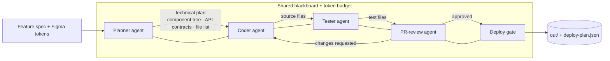

# agentic-sdlc-pipeline

A multi-agent system that automates the software development lifecycle. Give it a
feature spec (and, optionally, exported Figma design tokens) and a chain of
specialized AI agents takes it from **design → plan → code → tests → review →
deploy gate** with minimal human intervention.

Built with **TypeScript** and the **Anthropic Claude API** (`claude-opus-4-8`,
adaptive thinking, structured outputs). This is a clean-room reference
implementation of a production agentic SDLC system.

> **Status:** reference implementation. The deploy agent writes approved
> artifacts to disk and emits a deploy plan rather than triggering a real
> Fastlane/CI deployment — swap `src/agents/deployer.ts` for your CI hooks.

---

## Architecture



Each agent reads from and writes to a shared **blackboard** (`src/blackboard.ts`)
that also enforces a run-wide **token budget** — a runaway agent can't burn
unbounded tokens. The orchestrator (`src/pipeline.ts`) detects unresolved review
loops and stops after `--max-rounds`.

| Agent | File | Responsibility | Claude call |
|-------|------|----------------|-------------|
| Planner | `src/agents/planner.ts` | Decompose into component tree, typed API contracts, and a file list | structured output (Zod) |
| Coder | `src/agents/coder.ts` | Generate source files that respect repo conventions | streamed text |
| Tester | `src/agents/tester.ts` | Author Jest + RNTL tests for the generated source | streamed text |
| Reviewer | `src/agents/reviewer.ts` | Flag security/perf/correctness/coverage issues; approve or block | structured output (Zod) |
| Deployer | `src/agents/deployer.ts` | Gate: write artifacts + deploy plan only on a green review | — |

## Quick start

```bash
npm install
cp .env.example .env        # add your ANTHROPIC_API_KEY

# Run the full pipeline on the bundled example
npm run dev -- run \
  --feature examples/feature.md \
  --design examples/design-tokens.json \
  --conventions examples/conventions.md \
  --out out
```

Build and run the compiled CLI:

```bash
npm run build
node dist/index.js run -f examples/feature.md -d examples/design-tokens.json -o out
```

### CLI

```
asdlc run --feature <path> [options]

  -f, --feature <path>       feature request (.md or .txt)        [required]
  -d, --design <path>        exported Figma design-tokens JSON
  -c, --conventions <path>   repo conventions file
  -o, --out <dir>            output directory (default: "out")
  -r, --max-rounds <n>       max review→fix rounds (default: 2)
```

The process exits `0` when the deploy gate is green, non-zero otherwise — so it
drops straight into a CI job.

## How it works

1. **Plan** — the planner returns a schema-validated `TechnicalPlan` (component
   tree, API contracts, and every file to create). Structured outputs guarantee
   the next agent receives typed data, not prose.
2. **Build** — the coder generates the source files; the tester writes matching
   Jest tests. Files are emitted in a strict delimited format and parsed
   deterministically.
3. **Review** — the reviewer cross-references the diff against the plan and
   conventions and returns a structured verdict. Blocking findings loop back to a
   fix pass; otherwise the run is approved.
4. **Deploy** — the gate writes artifacts and a `deploy-plan.json` only on a
   green review.

## Configuration

| Env var | Default | Purpose |
|---------|---------|---------|
| `ANTHROPIC_API_KEY` | — | required |
| `ASDLC_MODEL` | `claude-opus-4-8` | model id |
| `ASDLC_TOKEN_BUDGET` | `200000` | abort the run if cumulative tokens exceed this |

## License

MIT © Harpalsinh Jadav
